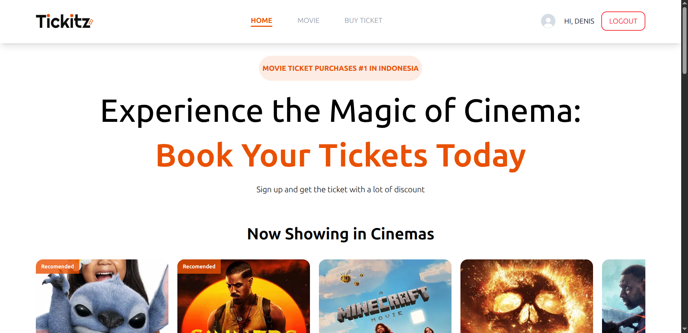

# Cinemax

A modern and responsive online ticketing application built with React and TypeScript, featuring state management, form validation, and Docker support for easy deployment.

## Preview



## 🚀 Features

- ✅ Create, read, update, and delete todos
- 🎨 Modern and responsive UI with Tailwind CSS
- 🔄 State management with Redux and Redux Persist
- 📝 Form validation with React Hook Form
- 🧭 Client-side routing with React Router DOM
- 💾 Data persistence across browser sessions
- 🐳 Docker support for containerized deployment
- ⚡ Fast development with Vite
- 📱 Mobile-friendly responsive design

## 🛠️ Tech Stack

- **Frontend Framework**: React 18 with TypeScript
- **Build Tool**: Vite
- **Styling**: Tailwind CSS
- **State Management**: Redux with Redux Persist
- **Routing**: React Router DOM
- **Form Handling**: React Hook Form
- **Icons**: React Icons
- **Containerization**: Docker

## 📋 Prerequisites

Before running this project, make sure you have the following installed:

- Node.js (version 16 or higher)
- npm or yarn
- Docker (optional, for containerized deployment)

## 🚀 Getting Started

### Local Development

1. **Clone the repository**
   ```bash
   git clone https://github.com/devbydenis/Cinemax-Prototype.git
   cd Cinemax-Prototype
   ```

2. **Install dependencies**
   ```bash
   npm install
   # or
   yarn install
   ```

3. **Start the development server**
   ```bash
   npm run dev
   # or
   yarn dev
   ```

4. **Open your browser**
   Navigate to `http://localhost:5173` to view the application.

### Docker Deployment

1. **Build the Docker image**
   ```bash
   docker build -t image-cinemax .
   ```

2. **Run the container**
   ```bash
   docker run -d --name container-cinemax -p 8080:80 image-cinemax
   ```

3. **Access the application**
   Open your browser and go to `http://localhost:8080`

<!-- ## 📁 Project Structure

```
react-todo/
├── public/
│   └── vite.svg
├── src/
│   ├── components/
│   │   └── [React components]
│   ├── pages/
│   │   └── [Page components]
│   ├── store/
│   │   └── [Redux store configuration]
│   ├── types/
│   │   └── [TypeScript type definitions]
│   ├── App.tsx
│   ├── main.tsx
│   └── index.css
├── Dockerfile
├── package.json
├── tailwind.config.js
├── tsconfig.json
├── vite.config.ts
└── README.md
``` -->

## 🔧 Configuration

### Tailwind CSS
The project uses Tailwind CSS for styling. Configuration can be found in `index.css`.

### Redux Store
State management is handled by Redux with persistence. Store configuration is located in the `src/redux` directory.

### Vite Configuration
Build tool configuration can be found in `vite.config.ts`.

## 📱 Features Overview

### Online Ticketing
- Add new tickets with form validation
- Mark tickets as complete/incomplete
- Edit existing tickets
- Delete order
- Filter movies (All, Active, Completed)

### Data Persistence
- All todos are automatically saved to localStorage using Redux Persist
- Data persists across browser sessions and page refreshes

### Responsive Design
- Fully responsive layout that works on desktop, tablet, and mobile devices
- Modern UI components with smooth animations and transitions

## 🤝 Contributing

1. Fork the repository
2. Create your feature branch (`git checkout -b feature/AmazingFeature`)
3. Commit your changes (`git commit -m 'Add some AmazingFeature'`)
4. Push to the branch (`git push origin feature/AmazingFeature`)
5. Open a Pull Request

## 📄 License

This project is licensed under the MIT License - see the [LICENSE](LICENSE) file for details.

## 🙏 Acknowledgments

- React team for the amazing framework
- Vite team for the fast build tool
- Tailwind CSS for the utility-f
